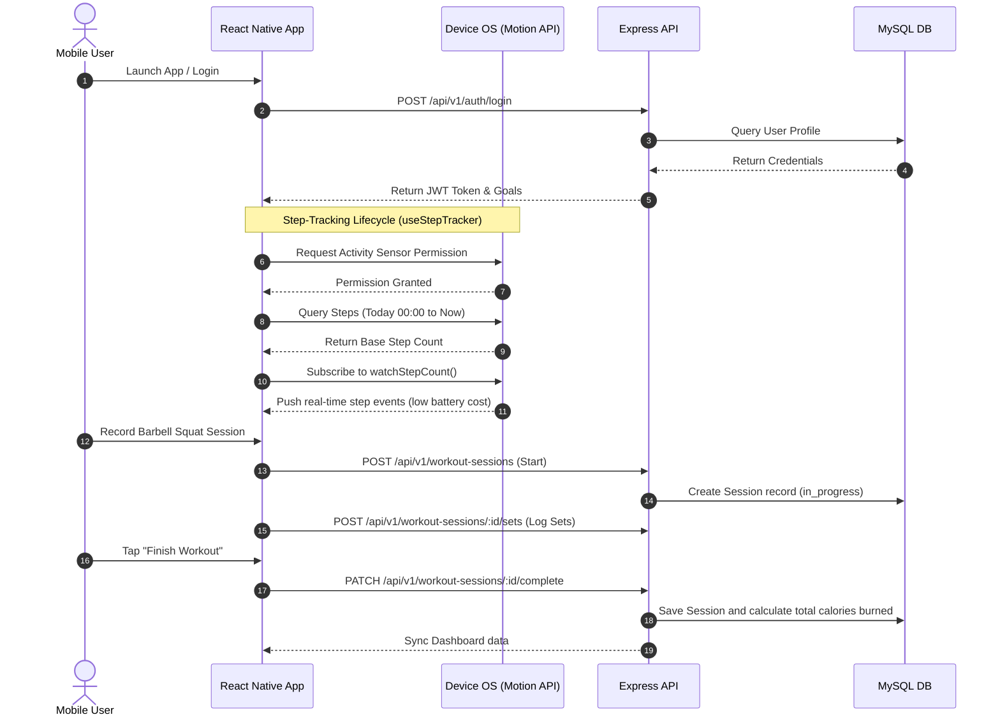

# Health and Fitness Tracking App - Codebase Architecture Guide

Welcome to the comprehensive technical guide for the Health and Fitness Tracking Application. This document provides a complete map of the codebase, explains the directory structure, describes what each file does, and details how the entire system functions together.

---

## 1. Monorepo Architecture Overview
The project is structured as a **TypeScript Monorepo** using npm workspaces. This enables sharing schemas, data types, and constants between the backend server and the mobile application, ensuring type safety across the entire stack.

### Unified Directory Map
*   **`shared/`**: Contains shared DTO schemas, TypeScript types, and system-wide API error constants.
*   **`backend/`**: Express.js server providing authentication, activity loggers, nutrition counters, reminder scheduling, and database seeding.
*   **`mobile/`**: React Native mobile app built with Expo (v54), Zustand for state management, React Navigation, and physical hardware sensors.
*   **`worker/`**: Background worker scripts (e.g., for notifications and reminder delivery).

---

## 2. Directory Structure & Key Files

### 📂 Shared Module (`/shared`)
This is the core contract layer between the frontend and backend. It ensures both workspaces share the exact same data definitions.
*   **`src/index.ts`**: The main entrypoint exporting unified interfaces and schemas.
*   **`src/dto/`**: Data Transfer Object definitions (e.g. Auth DTOs, Workout DTOs, Food DTOs).
*   **`src/error-codes.ts`**: System-wide standardized error codes (e.g., `UNAUTHORIZED`, `VALIDATION_ERROR`, `NOT_FOUND`).

---

### 📂 Backend Service (`/backend`)
The backend is a TypeScript REST API utilizing Express.js for routing, Prisma for MySQL ORM mappings, and Zod for input validation.

#### Core Server Setup
*   **`src/server.ts`**: Launches the Express server and binds it to the configured port.
*   **`src/app.ts`**: Registers middleware (Helmet for security, CORS, custom Request ID generators, unified error handling) and mounts API routes.
*   **`prisma/schema.prisma`**: The database schema representing MySQL tables:
    *   `User` & `UserProfile`: Authentication and onboarding statistics (gender, height, timezone).
    *   `WorkoutPlan` & `WorkoutPlanExercise`: Exercise plan setups.
    *   `WorkoutSession` & `WorkoutSessionSet`: Real-time logged sets (reps, weight, duration, RPE).
    *   `ExerciseCatalog`: Seeded global reference catalog.
    *   `FoodCatalog`, `MealLog`, & `MealLogItem`: Calorie, macro, and meal slots logging.
    *   `DailyProgress`: Aggregate daily scores, total calories in/out, and activity minutes.
    *   `Reminder` & `DeviceToken`: Scheduling configurations and Expo Push notification configurations.
*   **`prisma/migrations/`**: Contains database migrations, including:
    *   `20260415000000_phase1_core_tracking/migration.sql`: Seeds the default global exercises (`Barbell Squat`, `Bench Press`, `Deadlift`, `Pull-up`, `Overhead Press`) and foods catalog.

#### Features Modules (`src/modules/`)
Each module contains dedicated controllers, routes, DTOs, serializers, and services:
1.  **`auth/`**: Standard JWT session-token signups, login, and refreshes.
2.  **`users/`**: Manages goal targets and profile metrics.
3.  **`body-metrics/`**: Logs daily weights (kg), waist measurements (cm), and body fat percentages.
4.  **`exercises/`**: Fetches translations and catalog items from the external **Wger API** or DB catalog.
5.  **`workouts/`**: Manages plans, logs sets, finishes sessions, and tracks active metrics.
6.  **`nutrition/`**: Logs meals, macro targets, and hooks into the **Open Food Facts API** for live food search and caching.
7.  **`progress/`**: Compiles daily summaries (calories consumed vs. active calories burned).
8.  **`reminders/`**: Handles push reminder scheduling for hydration, workouts, and sleep.

---

### 📂 Mobile Application (`/mobile`)
A modular React Native app configured for Expo. State is handled globally via Zustands stores, and routing is driven by React Navigation stack/tab navigators.

#### Core Configuration
*   **`package.json`**: Declares React Native and Expo version lock-ins, alongside essential dependencies like `expo-sensors`, `zustand`, `@react-navigation`, and `i18next`.
*   **`App.tsx`**: Main entrypoint initializing loaded custom fonts, secure auth stores, safe area overlays, and main navigation containers.
*   **`src/core/`**: Shared core systems:
    *   `i18n/`: Multi-language localized translations (English/Vietnamese).
    *   `lib/api.ts`: Wrapper for backend fetch requests automatically injecting JWT authorization headers.
    *   `navigation/`: Root stack bindings.
    *   `store/auth-store.ts`: Global session and profile zustand store.

#### Modular Features Structure (`src/features/`)

##### 🟦 `module01` — Design System & Onboarding
Provides structural UI blocks, themes, tokens, typography, and the onboarding flow:
*   **`theme/tokens.ts`**: Declares the primary color palettes, soft card shadows, gutters, border radii, and spatial touch constraints.
*   **`theme/fonts.ts`**: Configures Google Fonts (Inter, Outfit) for premium visual aesthetics.
*   **`screens/`**: Multi-step onboarding stack (Gender selection, Age, Height/Weight, Activity levels, Fitness Goals).

##### 🟩 `module02` — Notifications Hub
Manages message feeds and alerts:
*   **`store/notifications-hub-store.ts`**: Zustand state for keeping track of read/unread system notifications.

##### 🟨 `module03` — Progress & Body Metrics
Tracks user physiological logs over time:
*   **`screens/metrics-dashboard-screen.tsx`**: Renders weight graphs, goal comparisons, and progress summaries.
*   **`screens/add-weight-screen.tsx`**: Quick weight log slider.

##### 🟧 `module04` — Workouts & Logger
Handles training routines and session recording:
*   **`data/exercises.ts`**: The local exercise catalog containing high-quality steps, levels, muscles, and guide assets matching the seeded database.
*   **`screens/workout-list-screen.tsx`**: Real-time searchable exercise browser synced with backend `/exercises`.
*   **`screens/workout-player-screen.tsx`**: Active session player to track sets, record reps/weight, calculate MET-based calorie burn, and push logs to the server.
*   **`screens/workout-plan-screen.tsx`**: Multi-day scheduling breakdown routines.

##### 🟪 `module05` — Nutrition Tracker
Manages caloric intake and macro distributions:
*   **`data/nutrition-demo.ts`**: Seeded foods catalog corresponding to the backend data structures.
*   **`screens/nutrition-dashboard-screen.tsx`**: Premium dashboard showing daily intake totals, goals, and macro progress bars (Protein, Carbs, Fats). Includes a custom water intake tracker.
*   **`screens/nutrition-add-food-screen.tsx`**: Real-time food search engine powered by Open Food Facts and custom food logging.
*   **`screens/nutrition-barcode-screen.tsx`**: Quick-scan camera scanner.

##### 🔷 `module06` — Home Dashboard
Unified activity index for general summaries:
*   **`screens/home-dashboard-screen.tsx`**: Dynamic premium hub showing daily streaks, wellness readiness score, total active calories, step counters, and active session statuses.
*   **`components/home-coach-fab-sheet.tsx`**: Floating interactive coach guide.

##### 👟 `step-tracking` — Hardware Step Sensor Tracker
*   **`hooks/useStepTracker.ts`**: Custom hardware sensor hook utilizing Expo Pedometer. It automatically requests system motion permissions, loads today's steps natively, and watches real-time walk updates using low-power hardware.
*   **`screens/StepTrackingScreen.tsx`**: Premium step tracking visual display featuring custom progress rings, live stat counters (calories, active minutes, distance), sensor diagnostic controls, and a historical weekly breakdown bar chart.

---

## 3. How the App Works (Core Lifecycle Flow)

1.  **Authentication & Onboarding**: The user signs up, runs through the 6-step questionnaire which calculates their initial BMR, and stores a secure session JWT token inside the secure mobile store.
2.  **Native Sensor Sync**: The app hooks into the device's hardware step sensor. Steps are tracked automatically in the background by the OS. When the app opens, it polls the background data and continues updating in real-time.
3.  **Active Workout Logs**: When the user records a workout session, sets are validated in real-time and saved to the backend database. This updates the daily aggregate metrics.
4.  **Calorie & Macro Sync**: Meal inputs are queried directly against catalog items (or Open Food Facts for new food caches), calculating macro values dynamically.
