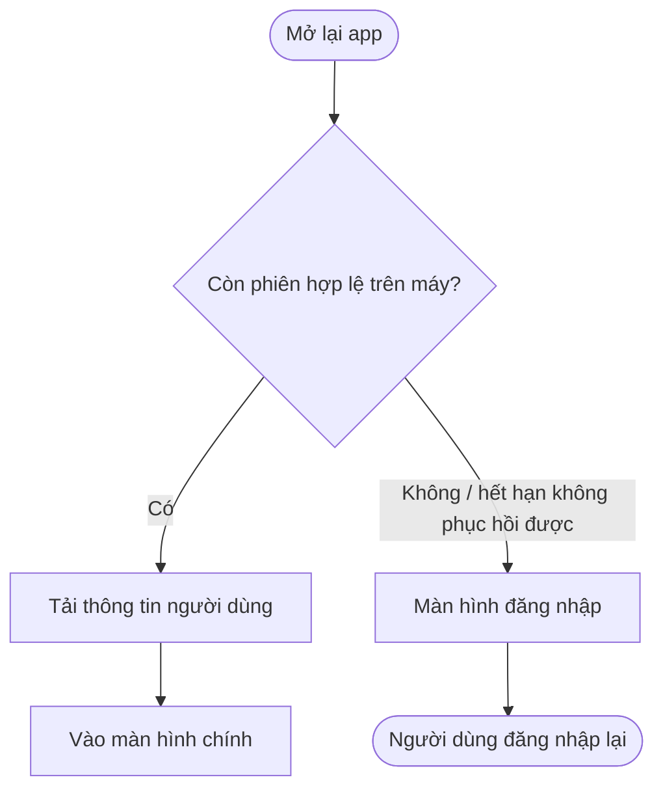
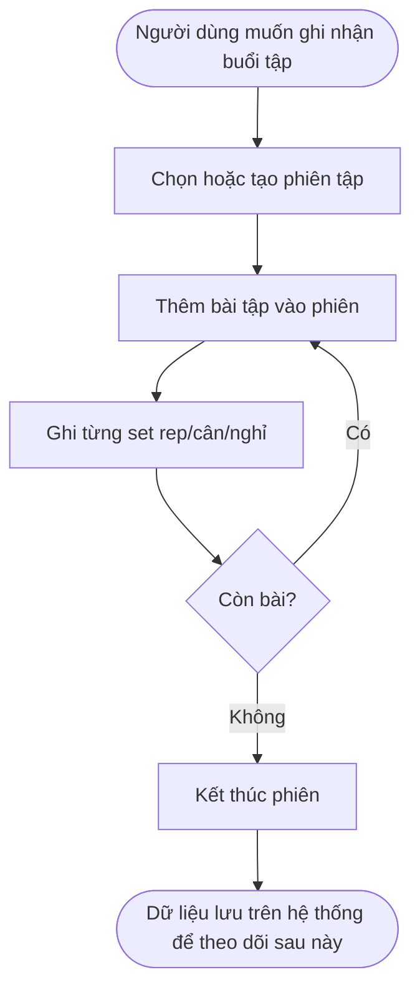
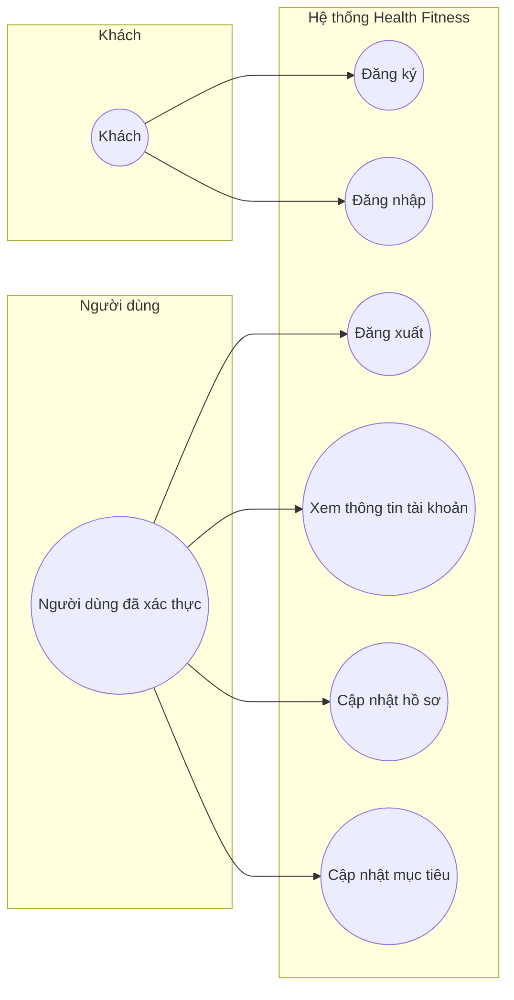
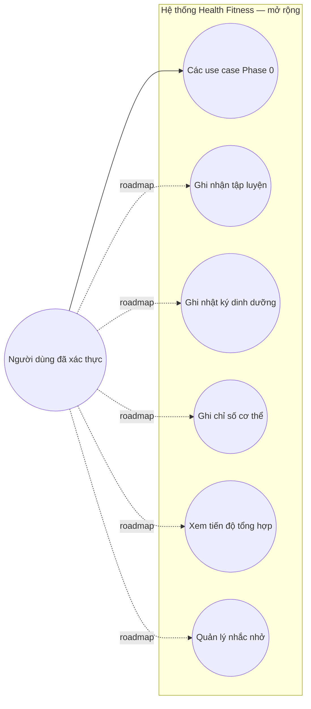
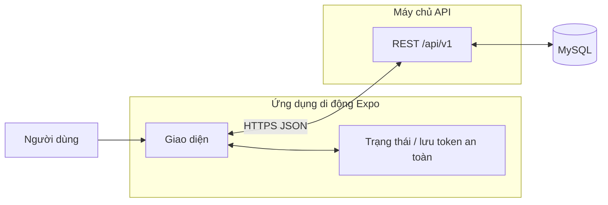

# Chuẩn bị buổi học — Phân tích chức năng, luồng nghiệp vụ, tương tác

Tài liệu này phục vụ **Pre-class** và **In-class**: sơ đồ phân rã chức năng, luồng nghiệp vụ (góc người dùng), sơ đồ tương tác chính.  
**Chú thích trạng thái:** ✅ đã có trong mã nguồn (Phase 0) · 🔜 thiết kế / roadmap (Phase 1+).

---

## 1. Sơ đồ phân rã chức năng (Functional Decomposition)

Mục đích: thể hiện **cấu trúc cây** từ hệ thống → nhóm chức năng → chức năng con (không đi sâu class/code).

```mermaid
flowchart TB
  HF[Hệ thống Health Fitness]

  HF --> A[Quản lý tài khoản và phiên đăng nhập]
  HF --> B[Quản lý hồ sơ và mục tiêu cá nhân]
  HF --> C[Ghi nhận tập luyện]
  HF --> D[Ghi nhận dinh dưỡng]
  HF --> E[Theo dõi chỉ số cơ thể]
  HF --> F[Tổng hợp tiến độ và báo cáo]
  HF --> G[Nhắc nhở và thông báo]
  HF --> H[Hạ tầng kỹ thuật dùng chung]

  A --> A1[Đăng ký tài khoản ✅]
  A --> A2[Đăng nhập / đăng xuất ✅]
  A --> A3[Làm mới phiên đăng nhập ✅]
  A --> A4[Thu hồi phiên refresh ✅]

  B --> B1[Xem thông tin người dùng hiện tại ✅]
  B --> B2[Cập nhật hồ sơ cá nhân ✅]
  B --> B3[Thiết lập / cập nhật mục tiêu ✅]

  C --> C1[Danh mục bài tập 🔜]
  C --> C2[Kế hoạch buổi tập 🔜]
  C --> C3[Ghi log phiên tập và từng set 🔜]

  D --> D1[Danh mục thức ăn 🔜]
  D --> D2[Ghi nhật ký bữa ăn và macro 🔜]

  E --> E1[Ghi nhận cân nặng / vòng eo / % mỡ 🔜]

  F --> F1[Bảng tổng hợp theo ngày/tuần 🔜]
  F --> F2[Biểu đồ xu hướng 🔜]

  G --> G1[Lập lịch nhắc nhở 🔜]
  G --> G2[Gửi thông báo đẩy 🔜]

  H --> H1[API REST phiên bản hóa ✅]
  H --> H2[Hợp đồng lỗi thống nhất ✅]
  H --> H3[Đồng bộ kiểu client–server shared ✅]
  H --> H4[Worker / hàng đợi tác vụ nền 🔜]
```



**Giải thích luồng:**

Hệ thống được chia thành **8 nhóm chức năng** lớn, phản ánh đúng vòng đời sử dụng của người dùng:

- **Quản lý tài khoản:** Đây là cổng vào của toàn bộ hệ thống. Người dùng bắt buộc phải đăng ký và đăng nhập trước khi làm bất kỳ thao tác nào. Phiên đăng nhập được duy trì tự động (refresh token), và có thể thu hồi khi đăng xuất — đảm bảo bảo mật.
- **Hồ sơ và mục tiêu:** Sau khi có tài khoản, người dùng khai báo thông tin cá nhân (chiều cao, cân nặng, mức vận động) và đặt mục tiêu (giảm cân, tăng cơ, duy trì). Dữ liệu này làm nền để tính toán gợi ý ở các module sau.
- **Tập luyện / Dinh dưỡng / Chỉ số cơ thể:** Ba nhóm này là **lõi nghiệp vụ** — người dùng ghi nhận hoạt động hàng ngày. Thiết kế tách riêng để mỗi nhóm có schema DB và logic riêng, không phụ thuộc chéo.
- **Tiến độ và báo cáo:** Tổng hợp dữ liệu từ ba nhóm trên, hiển thị xu hướng theo thời gian. Đây là module **đọc nhiều, ghi ít** — phù hợp với tối ưu hóa riêng (cache, worker tổng hợp định kỳ).
- **Nhắc nhở:** Chức năng tự động, chạy nền qua worker + Redis, không gắn vào request lifecycle.
- **Hạ tầng dùng chung:** Không phải chức năng người dùng thấy trực tiếp, nhưng là xương sống đảm bảo mọi module hoạt động đúng và nhất quán (validation, error contract, tracing).

**Gợi ý trình bày trên lớp:** Bắt đầu từ nút gốc, đọc từng nhánh; nhấn mạnh phần ✅ đã làm và phần 🔜 là lộ trình hợp lý (MVP trước, mở rộng sau).

---

## 2. Luồng nghiệp vụ chính (Business flow — góc người dùng)

Các sơ đồ dưới đây mô tả **việc người dùng muốn làm gì**, không mô tả JWT/bcrypt (đó là luồng kỹ thuật, để phần báo cáo kỹ thuật).

### 2.1 Lần đầu sử dụng — tạo tài khoản và vào ứng dụng (✅)


**Giải thích từng bước:**

| Bước | Hành động | Điều xảy ra trong hệ thống |
|------|-----------|---------------------------|
| 1 | Người dùng mở app lần đầu | App kiểm tra bộ nhớ an toàn — không tìm thấy token → hiển thị màn hình đăng nhập |
| 2a | Chưa có tài khoản → nhấn "Đăng ký" | Chuyển sang màn hình đăng ký |
| 3a | Nhập email và mật khẩu (≥ 8 ký tự) | Client gọi `POST /api/v1/auth/register`. Server kiểm tra email chưa tồn tại, mã hóa mật khẩu, tạo tài khoản + hồ sơ trống |
| 4a | Đăng ký thành công | Server trả về access token + refresh token. App lưu vào Secure Storage và chuyển về màn hình chính |
| 2b | Đã có tài khoản → nhập email/mật khẩu | Client gọi `POST /api/v1/auth/login`. Server so khớp mật khẩu |
| 3b | Thông tin sai | Server trả lỗi 401. App hiển thị thông báo lỗi, người dùng nhập lại |
| 4b | Thông tin đúng | Server trả về token pair. App lưu và chuyển màn hình chính |

> **Điểm cần nhấn mạnh khi trình bày:** Sau khi đăng ký, người dùng vào thẳng app mà không cần đăng nhập lại — trải nghiệm liền mạch, thực hiện bằng cách server trả token ngay trong response đăng ký.

---

### 2.2 Khởi động lại app — nhớ phiên đăng nhập (✅)



**Giải thích từng bước:**

| Bước | Hành động | Điều xảy ra trong hệ thống |
|------|-----------|---------------------------|
| 1 | App khởi động | App gọi hàm `hydrate()` trong auth store — đây là bước đầu tiên trước khi render bất kỳ màn hình nào. App hiển thị màn hình loading ("Starting...") trong lúc chờ |
| 2 | Đọc Secure Storage | Lấy access token và refresh token đã lưu trên thiết bị |
| 3a | Token tồn tại | App gọi `GET /api/v1/me` với access token để xác nhận phiên còn hiệu lực và tải thông tin người dùng |
| 4a | Thành công | Lưu thông tin người dùng vào state → chuyển thẳng vào màn hình chính, không cần đăng nhập lại |
| 3b | Token không hợp lệ / hết hạn toàn bộ | App xóa token khỏi Secure Storage, chuyển về màn hình đăng nhập |

> **Điểm cần nhấn mạnh:** Nếu access token hết hạn nhưng refresh token còn hiệu lực, app **tự động làm mới** access token trong nền (transparent refresh) trước khi tải `/me` — người dùng không nhận ra có bước làm mới này. Chỉ khi cả hai đều hết hạn mới yêu cầu đăng nhập lại.

---

### 2.3 Cập nhật hồ sơ và mục tiêu (✅)


**Giải thích từng bước:**

| Bước | Hành động | Điều xảy ra trong hệ thống |
|------|-----------|---------------------------|
| 1 | Mở màn hình hồ sơ | App gọi `GET /api/v1/me` để lấy thông tin mới nhất, hiển thị loading trong lúc chờ |
| 2 | Xem thông tin hiện tại | Hiển thị form điền sẵn các giá trị đang lưu (họ tên, giới tính, ngày sinh, chiều cao, mức vận động, mục tiêu) |
| 3a | Sửa hồ sơ | Người dùng chỉnh các trường cá nhân. Khi nhấn lưu → `PATCH /api/v1/me/profile`. Chỉ gửi các trường thay đổi (partial update) |
| 3b | Sửa mục tiêu | Người dùng chọn loại mục tiêu (giảm cân / tăng cơ / duy trì) và điền chỉ tiêu. Khi nhấn lưu → `PUT /api/v1/me/goals` |
| 4 | Validation thất bại | Server trả lỗi 400 kèm trường cụ thể sai. App hiển thị thông báo bên cạnh trường đó |
| 5 | Validation thành công | Server cập nhật DB, trả về toàn bộ thông tin người dùng mới nhất. App cập nhật state |

> **Điểm cần nhấn mạnh:** Cập nhật mục tiêu dùng chiến lược **replace** (PUT, không PATCH) — mỗi lần thay đổi mục tiêu sẽ tạo một bản ghi mới, các bản cũ giữ nguyên với cờ `is_active = false`. Điều này cho phép xem **lịch sử mục tiêu** sau này mà không mất dữ liệu.

---

### 2.4 Luồng nghiệp vụ mục tiêu — ghi buổi tập (🔜 thiết kế)

Dùng để trình bày **tính hợp lý** của roadmap, chưa cần code đầy đủ.



**Giải thích từng bước:**

| Bước | Hành động | Điều xảy ra trong hệ thống |
|------|-----------|---------------------------|
| 1 | Chọn / tạo phiên tập | Người dùng có thể bắt đầu tập tự do hoặc chọn từ một kế hoạch tập đã lập sẵn. Hệ thống tạo bản ghi `workout_session` với trạng thái "đang tập", ghi lại thời điểm bắt đầu |
| 2 | Thêm bài tập | Người dùng tìm và chọn bài từ danh mục `exercise_catalog` (ví dụ: "Bench Press", "Squat"). Có thể thêm nhiều bài |
| 3 | Ghi từng set | Với mỗi set thực hiện: nhập số rep, cân nặng sử dụng, thời gian nghỉ. Hệ thống lưu từng dòng vào `workout_session_sets` |
| 4 | Lặp lại | Người dùng tiếp tục thêm bài và ghi set cho đến khi xong buổi tập |
| 5 | Kết thúc phiên | Hệ thống ghi lại thời điểm kết thúc, tính tổng thời gian, tổng khối lượng. Phiên được đánh dấu "hoàn thành" |

> **Điểm thiết kế cần thảo luận trên lớp:** Nên cho phép ghi nhận buổi tập **không theo kế hoạch** (ad-hoc) từ đầu — người dùng thường không tập đúng 100% kế hoạch. Cần cân nhắc tính năng "clone từ buổi trước" để giảm bước nhập liệu lặp.

---

### 2.5 Luồng nghiệp vụ mục tiêu — ghi bữa ăn (🔜 thiết kế)


**Giải thích từng bước:**

| Bước | Hành động | Điều xảy ra trong hệ thống |
|------|-----------|---------------------------|
| 1 | Chọn bữa ăn | Người dùng chọn bữa (sáng / trưa / tối / snack) và ngày ghi nhận. Hệ thống tạo hoặc mở bản ghi `meal_log` tương ứng |
| 2 | Thêm món | Người dùng tìm món trong danh mục `food_catalog` hoặc nhập tên tùy chỉnh, chọn khẩu phần (gram, cốc, phần...) |
| 3 | Tính macro tự động | Hệ thống tra cứu thông tin dinh dưỡng từ `food_catalog` (protein, carb, fat, kcal trên đơn vị), nhân với số lượng → hiển thị ngay kết quả |
| 4 | Người dùng kiểm tra | Xem tổng kcal và macro của bữa so với mục tiêu ngày. Có thể thêm/xóa món trước khi lưu |
| 5 | Lưu | Tạo các bản ghi `meal_log_items` — mỗi dòng lưu **snapshot macro tại thời điểm đó** (không phụ thuộc catalog thay đổi sau này) |

> **Điểm thiết kế cần thảo luận trên lớp:** Tại sao lưu snapshot macro thay vì chỉ lưu `food_id`? — Nếu thông tin dinh dưỡng trong catalog được cập nhật (sửa sai), lịch sử của người dùng sẽ bị ảnh hưởng. Snapshot bảo toàn tính trung thực của dữ liệu lịch sử.

---

## 3. Sơ đồ tương tác chính (Actors & use cases)

### 3.1 Tác nhân (actors)

| Actor | Mô tả |
|-------|--------|
| **Người dùng đã xác thực** | Người dùng ứng dụng di động sau khi đăng nhập (hoặc phiên được khôi phục). |
| **Khách (chưa đăng nhập)** | Chỉ thực hiện đăng ký / đăng nhập. |
| **Hệ thống Health Fitness** | Ranh giới: mobile app + API + CSDL (theo thiết kế monorepo). |

### 3.2 Sơ đồ use case — phạm vi hiện triển khai (Phase 0)



**Giải thích tương tác:**

- **Khách** chỉ tiếp cận được hai use case không yêu cầu xác thực: đăng ký và đăng nhập. Đây là ranh giới bảo mật cứng — toàn bộ dữ liệu cá nhân đều được bảo vệ sau lớp xác thực.
- **Người dùng đã xác thực** là trạng thái sau khi Khách đăng nhập thành công. Từ đây, người dùng có thể quản lý phiên (đăng xuất), xem và chỉnh sửa thông tin cá nhân và mục tiêu.
- **Đăng xuất (UC3)** yêu cầu cả access token lẫn refresh token — đảm bảo phiên bị thu hồi hoàn toàn trên server, không chỉ xóa token trên thiết bị.
- **Cập nhật hồ sơ (UC5)** và **Cập nhật mục tiêu (UC6)** là hai use case tách biệt vì có logic và ràng buộc dữ liệu khác nhau (profile: upsert một bản ghi; goals: thay thế + giữ lịch sử).

---

### 3.3 Sơ đồ use case — mở rộng theo roadmap (Phase 1+)



Đường nét đứt (`.->`) gợi ý **kế hoạch**, đường liền là **đã nằm trong phạm vi thiết kế tổng thể**.

**Giải thích tương tác mở rộng:**

- **UC7 — Ghi nhận tập luyện:** Người dùng ghi log phiên tập theo thời gian thực. Phụ thuộc vào danh mục bài tập (có thể seed sẵn hoặc cho phép tự thêm). Không phụ thuộc vào UC8/UC9.
- **UC8 — Ghi nhật ký dinh dưỡng:** Người dùng theo dõi kcal và macro từng bữa. Sử dụng danh mục thức ăn. Tách biệt hoàn toàn với module tập luyện.
- **UC9 — Ghi chỉ số cơ thể:** Ghi nhận đơn giản theo thời gian (cân nặng, % mỡ, vòng eo). Là chuỗi thời gian — cấu trúc DB đơn giản nhất trong ba module.
- **UC10 — Xem tiến độ:** **Phụ thuộc vào UC7, UC8, UC9** — chỉ có ý nghĩa khi đã có dữ liệu từ các module kia. Nên là module phát triển cuối trong Phase 1.
- **UC11 — Nhắc nhở:** Chạy độc lập, không phụ thuộc vào dữ liệu tập/ăn/đo. Sử dụng worker nền + Redis + Expo Push Notification.

> **Thứ tự triển khai gợi ý:** UC9 (đơn giản nhất) → UC7 → UC8 → UC10 → UC11. Trình bày để nhận góp ý GV về thứ tự này có hợp lý không.

---

## 4. Sơ đồ tương tác hệ thống (ngữ cảnh — Context)

Mục đích: cho thấy **tương tác chính giữa các khối**, không đi sâu endpoint.



**Giải thích tương tác giữa các khối:**

| Tương tác | Chiều | Mô tả chi tiết |
|-----------|-------|----------------|
| Người dùng → Giao diện | Một chiều | Người dùng thao tác cảm ứng: nhấn, nhập, cuộn. UI phản hồi ngay (local state) trước khi có kết quả từ server |
| Giao diện ↔ Trạng thái/Token | Hai chiều | Giao diện đọc state (thông tin user, token) để quyết định hiển thị gì. Sau mỗi thao tác thành công (đăng nhập, cập nhật), state được cập nhật và giao diện tự render lại |
| Giao diện ↔ API | Hai chiều (HTTPS/JSON) | Mọi giao tiếp với server đi qua một lớp client duy nhất (`apiFetch`). Không có `fetch()` trực tiếp trong component UI. Kết quả trả về là JSON theo contract đã định nghĩa trong `@health-fitness/shared` |
| API ↔ MySQL | Hai chiều | API đọc/ghi dữ liệu qua Prisma ORM. Prisma quản lý connection pool và dịch TypeScript query sang SQL. Migration quản lý schema |

**Điểm mở rộng trong roadmap:**

```
API --> Redis Queue --> Worker --> Expo Push Service --> Thiết bị người dùng
```

Worker chạy độc lập, lắng nghe hàng đợi Redis để xử lý tác vụ nền (gửi thông báo nhắc nhở, tổng hợp tiến độ định kỳ) mà không làm chậm API request.

---

## 5. Checklist trước khi lên lớp

| Hạng mục | Đã có trong file này? |
|----------|------------------------|
| Sơ đồ phân rã chức năng | Có (mục 1) |
| Giải thích ý nghĩa từng nhánh phân rã | Có (mục 1 — phần giải thích) |
| Luồng nghiệp vụ (ít nhất: đăng ký/đăng nhập, hồ sơ) | Có (mục 2.1–2.3) |
| Giải thích bảng từng bước cho mỗi luồng | Có (dưới mỗi sơ đồ) |
| Luồng nghiệp vụ tương lai (tập, ăn) để thảo luận hợp lý | Có (mục 2.4–2.5) |
| Tương tác actor / use case Phase 0 | Có (mục 3.2) |
| Tương tác actor / use case mở rộng + giải thích thứ tự | Có (mục 3.3) |
| Ngữ cảnh hệ thống + giải thích từng tương tác | Có (mục 4) |

**In-class:** Trình bày mục 1 → 3.2 (Phase 0) trước, sau đó mở 3.3 để nhận góp ý về **thứ tự ưu tiên module Phase 1**. Ghi nhận ý GV về tối ưu luồng (giảm bước, gộp màn hình, v.v.) và cập nhật lại sơ đồ sau buổi học.

---

## 6. Xuất hình để nộp / trình chiếu

- **Trong VS Code / Cursor:** cài extension "Markdown Preview Mermaid Support" hoặc mở preview có hỗ trợ Mermaid.
- **Online:** dán nội dung khối ` ```mermaid ` vào [mermaid.live](https://mermaid.live) để xuất PNG/SVG.
- **Slide:** chụp màn hình từ preview hoặc dán SVG vào PowerPoint/Google Slides.

---

*Tài liệu bổ sung cho `docs/architecture.md` và các báo cáo trong repo; không thay thế tài liệu kỹ thuật chi tiết.*
