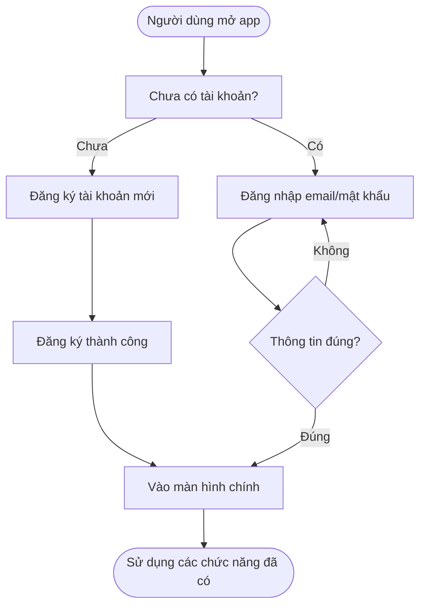
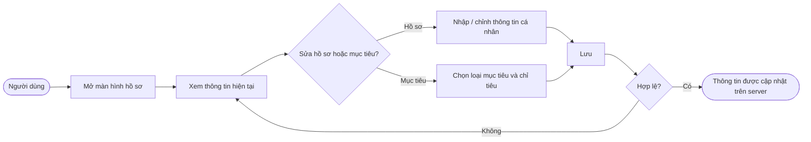
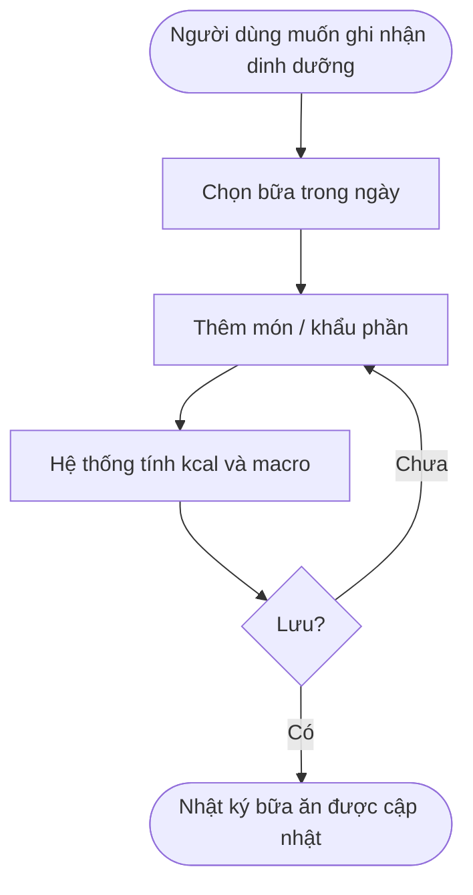
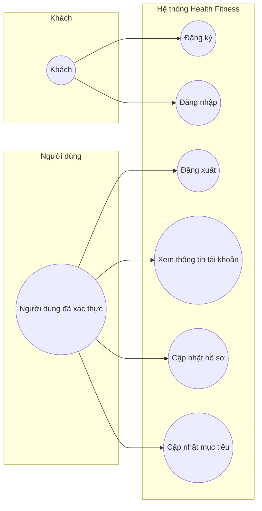
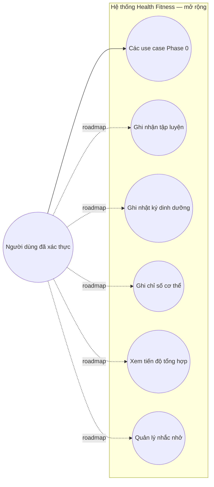
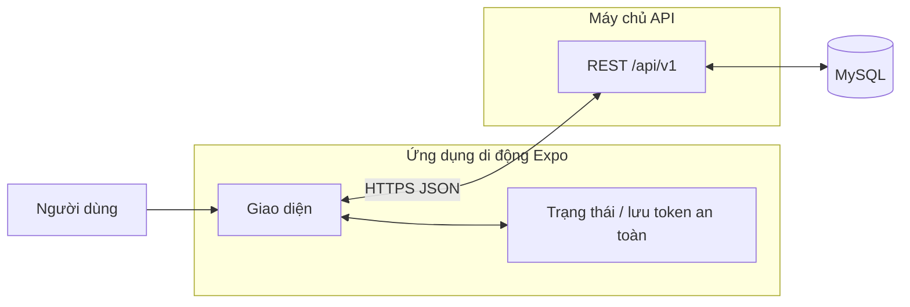

# Chuẩn bị buổi học — Phân tích chức năng, luồng nghiệp vụ, tương tác

Tài liệu này phục vụ **Pre-class** và **In-class**: sơ đồ phân rã chức năng, luồng nghiệp vụ (góc người dùng), sơ đồ tương tác chính.  
**Chú thích trạng thái:** ✅ đã có trong mã nguồn (Phase 0) · 🔜 thiết kế / roadmap (Phase 1+).

---

## 1. Sơ đồ phân rã chức năng (Functional Decomposition)

Mục đích: thể hiện **cấu trúc cây** từ hệ thống → nhóm chức năng → chức năng con (không đi sâu class/code).

```mermaid
flowchart TB
  HF[Hệ thống Health Fitness]

  HF --> A[Quản lý tài khoản và phiên đăng nhập]
  HF --> B[Quản lý hồ sơ và mục tiêu cá nhân]
  HF --> C[Ghi nhận tập luyện]
  HF --> D[Ghi nhận dinh dưỡng]
  HF --> E[Theo dõi chỉ số cơ thể]
  HF --> F[Tổng hợp tiến độ và báo cáo]
  HF --> G[Nhắc nhở và thông báo]
  HF --> H[Hạ tầng kỹ thuật dùng chung]

  A --> A1[Đăng ký tài khoản ✅]
  A --> A2[Đăng nhập / đăng xuất ✅]
  A --> A3[Làm mới phiên đăng nhập ✅]
  A --> A4[Thu hồi phiên refresh ✅]

  B --> B1[Xem thông tin người dùng hiện tại ✅]
  B --> B2[Cập nhật hồ sơ cá nhân ✅]
  B --> B3[Thiết lập / cập nhật mục tiêu ✅]

  C --> C1[Danh mục bài tập 🔜]
  C --> C2[Kế hoạch buổi tập 🔜]
  C --> C3[Ghi log phiên tập và từng set 🔜]

  D --> D1[Danh mục thức ăn 🔜]
  D --> D2[Ghi nhật ký bữa ăn và macro 🔜]

  E --> E1[Ghi nhận cân nặng / vòng eo / % mỡ 🔜]

  F --> F1[Bảng tổng hợp theo ngày/tuần 🔜]
  F --> F2[Biểu đồ xu hướng 🔜]

  G --> G1[Lập lịch nhắc nhở 🔜]
  G --> G2[Gửi thông báo đẩy 🔜]

  H --> H1[API REST phiên bản hóa ✅]
  H --> H2[Hợp đồng lỗi thống nhất ✅]
  H --> H3[Đồng bộ kiểu client–server shared ✅]
  H --> H4[Worker / hàng đợi tác vụ nền 🔜]
```



**Gợi ý trình bày trên lớp:** Bắt đầu từ nút gốc, đọc từng nhánh; nhấn mạnh phần ✅ đã làm và phần 🔜 là lộ trình hợp lý (MVP trước, mở rộng sau).

---

## 2. Luồng nghiệp vụ chính (Business flow — góc người dùng)

Các sơ đồ dưới đây mô tả **việc người dùng muốn làm gì**, không mô tả JWT/bcrypt (đó là luồng kỹ thuật, để phần báo cáo kỹ thuật).

### 2.1 Lần đầu sử dụng — tạo tài khoản và vào ứng dụng (✅)



### 2.2 Khởi động lại app — nhớ phiên đăng nhập (✅)


### 2.3 Cập nhật hồ sơ và mục tiêu (✅)



### 2.4 Luồng nghiệp vụ mục tiêu — ghi buổi tập (🔜 thiết kế)

Dùng để trình bày **tính hợp lý** của roadmap, chưa cần code đầy đủ.


### 2.5 Luồng nghiệp vụ mục tiêu — ghi bữa ăn (🔜 thiết kế)



---

## 3. Sơ đồ tương tác chính (Actors & use cases)

### 3.1 Tác nhân (actors)

| Actor | Mô tả |
|-------|--------|
| **Người dùng đã xác thực** | Người dùng ứng dụng di động sau khi đăng nhập (hoặc phiên được khôi phục). |
| **Khách (chưa đăng nhập)** | Chỉ thực hiện đăng ký / đăng nhập. |
| **Hệ thống Health Fitness** | Ranh giới: mobile app + API + CSDL (theo thiết kế monorepo). |

### 3.2 Sơ đồ use case — phạm vi hiện triển khai (Phase 0)



### 3.3 Sơ đồ use case — mở rộng theo roadmap (Phase 1+)



Đường nét đứt (`.->`) gợi ý **kế hoạch**, đường liền là **đã nằm trong phạm vi thiết kế tổng thể**.

---

## 4. Sơ đồ tương tác hệ thống (ngữ cảnh — Context)

Mục đích: cho thấy **tương tác chính giữa các khối**, không đi sâu endpoint.



**Gợi ý nói thêm:** Worker + Redis + push nằm trong roadmap; có thể vẽ thêm một nhánh `API --> Queue --> Worker` khi trình bày phần mở rộng.

---

## 5. Checklist trước khi lên lớp

| Hạng mục | Đã có trong file này? |
|----------|------------------------|
| Sơ đồ phân rã chức năng | Có (mục 1) |
| Luồng nghiệp vụ (ít nhất: đăng ký/đăng nhập, hồ sơ) | Có (mục 2.1–2.3) |
| Luồng nghiệp vụ tương lai (tập, ăn) để thảo luận hợp lý | Có (mục 2.4–2.5) |
| Tương tác actor / use case | Có (mục 3) |
| Ngữ cảnh hệ thống | Có (mục 4) |

**In-class:** Trình bày mục 1 → 3 (Phase 0) trước, sau đó mở Phase 1 để nhận góp ý về **thứ tự ưu tiên** (ví dụ: ghi tập trước hay dinh dưỡng trước). Ghi nhận ý GV về tối ưu luồng (giảm bước, gộp màn hình, v.v.) và cập nhật lại sơ đồ sau buổi học.

---

## 6. Xuất hình để nộp / trình chiếu

- **Trong VS Code / Cursor:** cài extension “Markdown Preview Mermaid Support” hoặc mở preview có hỗ trợ Mermaid.
- **Online:** dán nội dung khối ` ```mermaid ` vào [mermaid.live](https://mermaid.live) để xuất PNG/SVG.
- **Slide:** chụp màn hình từ preview hoặc dán SVG vào PowerPoint/Google Slides.

---

*Tài liệu bổ sung cho `docs/architecture.md` và các báo cáo trong repo; không thay thế tài liệu kỹ thuật chi tiết.*
