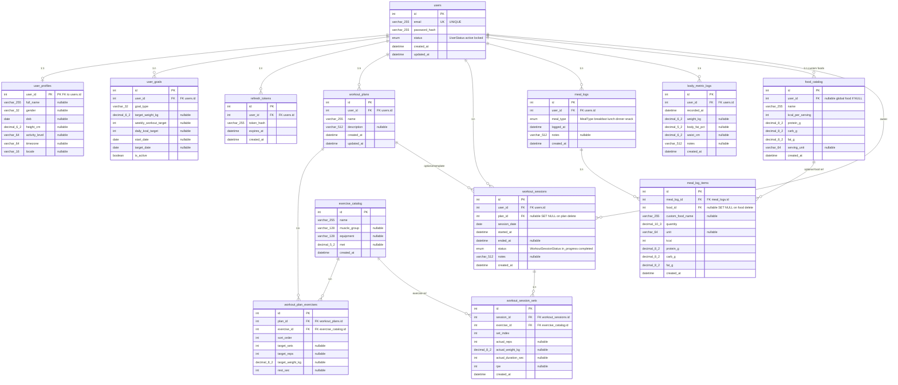

# Entity–Relationship diagram (MySQL / Prisma)

Nguồn sự thật: [`backend/prisma/schema.prisma`](../backend/prisma/schema.prisma). Tên bảng và cột dưới đây khớp `@@map` / `@map` trong Prisma.

## Enum (MySQL)

| Enum | Giá trị |
|------|---------|
| `UserStatus` | `active`, `locked` |
| `MealType` | `breakfast`, `lunch`, `dinner`, `snack` |
| `WorkoutSessionStatus` | `in_progress`, `completed` |

## Mermaid ER (đầy đủ field)

Render: GitHub/GitLab, VS Code (Mermaid preview), hoặc [mermaid.live](https://mermaid.live).

## Ghi chú index (tóm tắt)

| Bảng | Index (theo schema) |
|------|---------------------|
| `users` | UNIQUE `email` |
| `workout_plans` | `user_id` |
| `workout_plan_exercises` | `plan_id` |
| `workout_sessions` | `(user_id, session_date)` |
| `workout_session_sets` | `session_id` |
| `food_catalog` | `user_id`, `name` |
| `meal_logs` | `(user_id, logged_at)` |
| `meal_log_items` | `meal_log_id` |
| `body_metric_logs` | `(user_id, recorded_at)` |
| `user_goals` | `user_id` |
| `refresh_tokens` | `user_id`, `token_hash` |

## Khóa ngoại (hành vi xóa chính)

- `user_profiles`, `user_goals`, `refresh_tokens`, `workout_plans`, `workout_sessions`, `meal_logs`, `body_metric_logs`, `food_catalog` (khi `user_id` set): **ON DELETE CASCADE** từ `users`.
- `workout_plan_exercises`: CASCADE theo `workout_plans`; **RESTRICT** nếu xóa `exercise_catalog` đang được tham chiếu.
- `workout_sessions.plan_id`: **SET NULL** khi xóa plan.
- `workout_session_sets`: CASCADE theo session; **RESTRICT** trên `exercise_catalog`.
- `meal_log_items.food_id`: **SET NULL** khi xóa món trong `food_catalog`.
